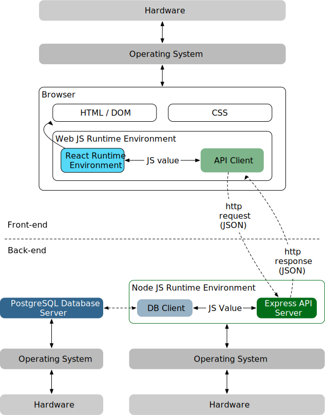
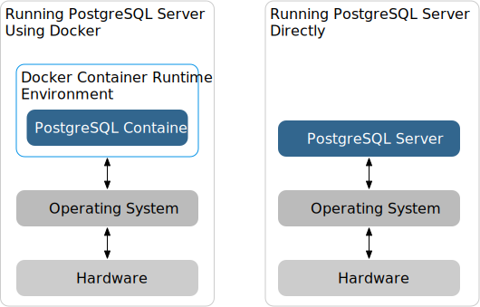

# Application Stack

This is a fairly typical architecture of a modern application, which consists
of client-side (front-end) and server-side (back-end) code and infrastructure.

In this example, we're specifically building a web application which runs
inside a browser, but the client can just as easily be a native mobile app.

There are three major components:

- Client: Our web app consists of some HTML, CSS, and a whole lot of
  JavaScript, mostly in the form of React components. This is the user
  interface ("UI").
- API Server: We use Express as our HTTP API server, which accepts requests
  from browsers, and provides a response to each request.
- Database Server: We persist our data to the database, so even if the user
  closes their browser window, or if the API server shuts down, the data will
  still be there when things start back up.

In the diagram you'll notice that each component runs on different
hardware—this is the most likely scenario in production. However, when you're
doing development, most of the time you run all of the components on the same
machine.

## JavaScript Runtime Environments

We write both our client and server code in JavaScript. However, the client
code runs inside a browser, and the server code runs, well, on a server. They
run in different JavaScript runtime environments. All JS runtime environments
come with the [JavaScript built-ins][] as a common base.

Your React code runs in a web JS runtime environment, which additionally comes
with the [Web API][]. Because we've included React as a package in our client
code, we add its functionality to the web JS runtime environment, allowing us
to use features such as hooks and components which aren't part of JavaScript or
the Web API.

On the other hand, the server code runs in a Node JS runtime environment, which
comes with the [Node API][]. By including Express as a package in our server
code, we add its features to the runtime environment, allowing us to easily
define API routes and handle requests and provide responses. We also add the
`pg-promise` database client library, which adds the feature to the runtime
environment to allow us to talk to a PostgreSQL server.

## Application Programming Interface ("API")

The simplest way to think of an API is that it's a contract that describes how
to access a service (which is usually a collection of features). A fairly
common API, for example, is when you order something online. The contract
states that:

- You tell the merchant what items you want, along with your payment and
  shipping info.
- The merchant debits your payment method for the cost of the items.
- The merchant ships the item to your shipping info.

In this project, we use quite a few APIs.

### Client

- [Web API][]
- [React][]
- [ReactDOM][]

### Server

- [Node API][]
- [Express][]
- [pg-promise][]
- [dotenv][]
<!-- Todo: update after app is complete.
We also create our own API, which is based on the [HTTP protocol][http] since
it's a remote API (the client and the server aren't in the same physical
location). Currently our API has two features:

- Get a list of tasks
- Add a new task -->

Instead of calling an API function and getting a returned value, an HTTP API
operates on a request / response cycle.

HTTP-based APIs have these characteristics in their contracts:

- Request signature consists of the [request method][], the URL, and an
  optional body (in JSON).
- Response signature consists of the [response status code][] and an optional
  body (in JSON).

## Aside: How to Set Up PostgreSQL Server

You can install PostgreSQL server directly as a program that runs on your
operating system. A modern approach is to install and run it as a [Docker][]
container.

In this example project, we run the database server as a container.

[docker]: https://www.docker.com
[dotenv]: https://github.com/motdotla/dotenv
[express]: http://expressjs.com/en/api.html
[http]: https://developer.mozilla.org/en-US/docs/Web/HTTP/Overview
[javascript built-ins]: https://developer.mozilla.org/en-US/docs/Web/JavaScript/Reference
[node api]: https://nodejs.org/docs/latest-v14.x/api/index.html
[pg-promise]: http://vitaly-t.github.io/pg-promise/index.html
[react]: https://reactjs.org/docs/react-api.html
[reactdom]: https://reactjs.org/docs/react-dom.html
[request method]: https://developer.mozilla.org/en-US/docs/Web/HTTP/Methods
[response status code]: https://developer.mozilla.org/en-US/docs/Web/HTTP/Status
[web api]: https://developer.mozilla.org/en-US/docs/Web/Reference/API
